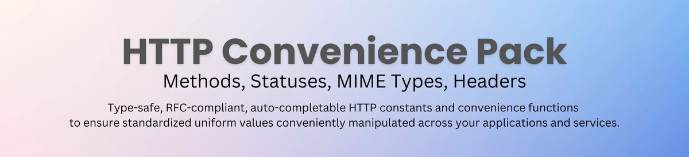

<hr>

<div align="center">
  
</div>

Use all the most popular HTTP constants collected in the same package with TypeScript type inference and IDE autocomplete for comfort and type safety.

**Summary**

The small dependency-free, TypeScript HTTP convenience package. Exposes uniform standardized RFC-compliant type-safe auto-completable HTTP constants to apply across your applications' ends and services along with the convenience functionality (validate, normalize, is among, of group, in group, make, extract, transform etc.).

**Package Status**


[](https://codecov.io/gh/WhereJuly/62-http-convenience-pack)


[](https://opensource.org/licenses/MIT)

<!-- WRITE: Will implement the badges at their time. -->
<!-- [](https://libraries.io/npm/package-name)

[](https://app.fossa.com/projects/git%2Bgithub.com%2Fusername%2Frepo?ref=badge_shield)

-->

<small>The package is in a usage-ready state, no pending functionality. It is actively maintained. It moves to production-ready `>= v1.0.0` as the initial usage feedback confirms it has no major missing use cases.</small>

# HTTP Convenience Pack

The pack purpose is to provide uniform standardized RFC-compliant HTTP constants' values for applications across the consumer's entire TypeScript application stack.

It adds the type safety and convenience of auto-complete. It allows to avoid string constants ambiguity, ensures you always get the same correct and uniform HTTP header name (or a MIME type, or a status code / message) sent from your one end (e.g. front) to the other (e.g. back) and / or across you services.

It is even more actual for development teams or open-source projects maintainers where multiple developers have to write code. Used as a part of a shared kernel, the package standardizes the entire HTTP constants not only across services but across people, that is equally important.

On top it has functionality that allows manipulating the application HTTP variables in a numerous comfortably declarative ways.

---

**Table of Contents**

- [Overview](#overview)
  - [Documentation](#documentation)
  - [Quick Start](#quick-start)
    - [Installation](#installation)
    - [Autocomplete Demo](#autocomplete-demo)
    - [Combined Usage Example](#combined-usage-example)
- [Modules](#modules)
  - [HTTP Methods](#http-methods)
  - [HTTP Statuses](#http-statuses)
  - [HTTP MIME Types](#http-mime-types)
  - [HTTP Headers](#http-headers)
- [Maintenance](#maintenance)
  - [Changelog](#changelog)
  - [Roadmap](#roadmap)
  - [Contributions](#contributions)
  - [License](#license)

## Overview

### Documentation

The package is carefully documented for comfortable developer experience.

From the good-named identifiers in code, thought-out autocompletion (see animated GIF [demo](#autocomplete-demo)), hover-popup doc blocks with usage examples on enums, constants classes and methods accessible with on-hover or `Ctrl-Left-click` when integrated with your IDE TypeScript setup (e.g. see [VS Code](https://code.visualstudio.com/Docs/languages/typescript)) to the detailed readme with use cases and the dedicated modules' API references.

As well there is a GitHub [Discussion](https://github.com/WhereJuly/62-http-convenience-pack/discussions) available for question and requests, as the usual GitHub [Issues](https://github.com/WhereJuly/62-http-convenience-pack/issues) for bug reporting.

**Code Conventions**

To ease the readability and autocomplete I apply the following conventions: start interface names with `I`, enums with `E`, type aliases with `T`, generics with `G`. Abbreviations are always in caps (satisfactory comfort). The domain-respective public API contains `HTTP` prefix to namespace the package members, the module name like `Statuses`, `Methods`, `MIME` etc.

As the names may feel rather long you can apply the imports aliasing like this:

```typescript
import { EHTTPMethods as EMethods, HTTPMethodsConvenience as Methods } from 'http-convenience-pack';
```

Hope you appreciate.

### Quick Start

#### Installation

```bash
npm install http-convenience-pack
```

#### Autocomplete Demo

Here is the short demo. The autocomplete works on all published API members. See the respective API References in the modules dedicated documentation.

<details>
  <summary>Watch</summary>
  <div align="center">
    
  </div>
</details>

#### [Combined Usage Example](.docs/combined-usage-example.md)

## Modules

### [HTTP Methods](.docs/methods.md)

### [HTTP Statuses](.docs/statuses.md)

### [HTTP MIME Types](.docs/mime-types.md)

### [HTTP Headers](.docs/headers.md)

## Maintenance

### Changelog

Will come with public updates.

### Roadmap

Will appear here when available.

### Contributions

Potentially valuable use cases / functionality suggestions are welcome either in [Discussions](https://github.com/WhereJuly/62-http-convenience-pack/discussions) or as [pull requests](#contribution).

If there is a Pull Request contribution, I would receive it on `integration` branch for discussion and manual merge.

### License

This project is licensed under the MIT License - see the LICENSE file for details.
